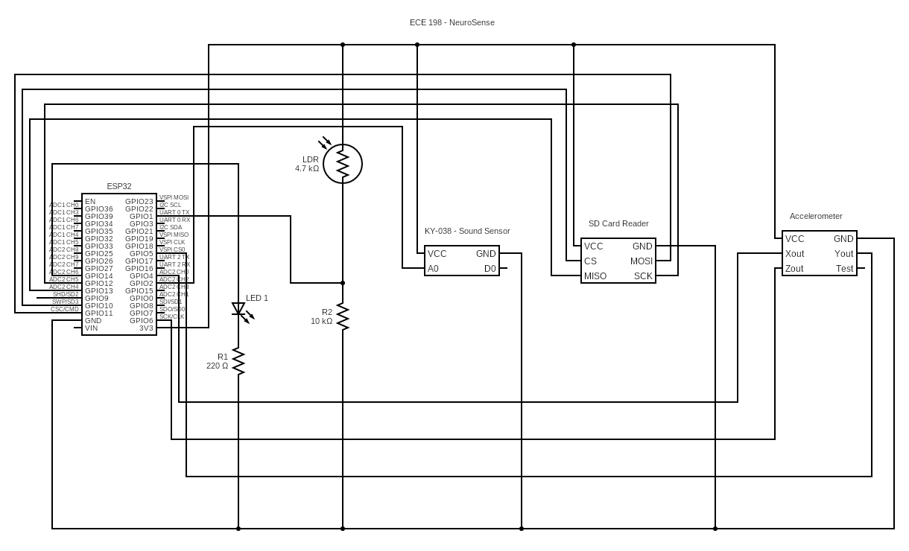
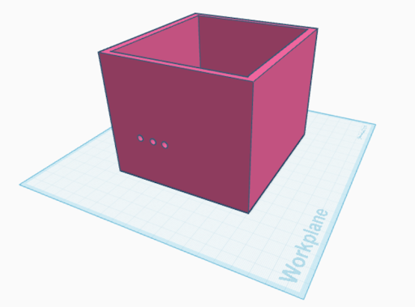
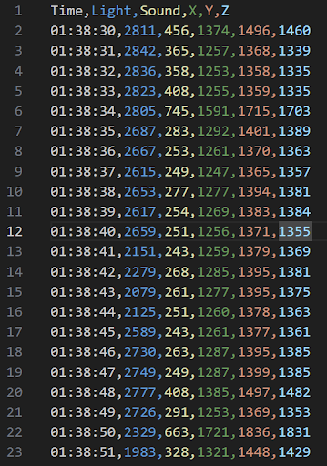
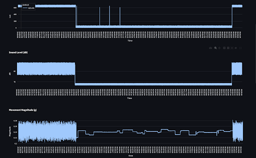
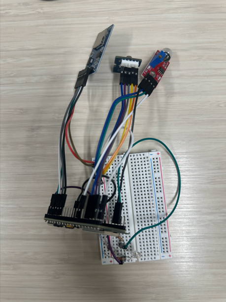

# NeuroSense  
**Environmental Sleep Disruption Monitoring for Hospital-Induced Delirium**

## Overview
**NeuroSense** is an embedded systems project developed as part of **ECE 198 (University of Waterloo)**. The project focuses on detecting **environmental risk factors associated with hospital-induced delirium (HID)**—specifically **sleep disruption caused by light, noise, and patient movement**.

Rather than attempting to diagnose delirium directly, NeuroSense provides **objective, time-stamped environmental data** that hospital staff can use to identify patterns linked to disrupted sleep and delirium-like symptoms.

The system consists of a compact, non-intrusive device mounted to a patient’s bed mattress that records overnight environmental conditions and exports them for visualization and analysis.

---

## Problem Motivation
Hospital-induced delirium is a common and serious condition, particularly in older hospitalized patients. Research shows that **sleep deprivation and nighttime environmental disturbances** are major, preventable contributors to delirium.

Hospitals often lack quantitative data describing:
- How bright patient rooms are at night  
- How noisy wards become during sleep hours  
- How often patients are disturbed or restless  

NeuroSense addresses this gap by **continuously logging environmental sleep disruptors**, allowing staff to correlate these metrics with patient outcomes and improve ward conditions.

---

## System Architecture

### Hardware Components
- **ESP32 (S3)** microcontroller  
- **Photoresistor (LDR)** – ambient light monitoring  
- **Analog sound sensor** – noise level tracking  
- **Accelerometer (ADXL345)** – patient/bed movement detection  
- **SD card reader** – local data storage  
- **LED indicator** – system status feedback

### Enclosure Design
The electronics are housed in a custom 3D-printed enclosure designed to mount securely to a hospital bed mattress.

All components operate at **3.3V** and are enclosed in a custom **3D-printed housing** designed to attach to a hospital bed mattress.

---

### Data Collection
- Sensors log data during a defined **sleep window (e.g., 10:00 PM – 6:00 AM)**  
- Each record includes:
  - Timestamp (NTP-synchronized)
  - Light level
  - Sound level
  - Accelerometer X, Y, Z values  
- Data is written to the SD card as **CSV files**
  

---

### Software Stack

#### Embedded (ESP32 / Arduino Framework)
- Sensor initialization and GPIO mapping  
- Wi-Fi connection for **NTP time synchronization**  
- SD card file handling and error recovery  
- CSV generation and logging control logic  
- Real-time validation via Serial Monitor  

Key features include:
- Automatic file creation and merging  
- Logging window enforcement  
- Robust SD-card error handling  

#### Data Visualization (Python)
- **Pandas** for CSV parsing  
- **Streamlit** for a lightweight local web interface  
- Generates interactive plots for:
  - Light levels over time  
  - Sound intensity trends  
  - Movement magnitude  

This allows staff or researchers to quickly identify **environmental disruptions during sleep**.

---

## Testing & Validation
- Tested with a **64 GB SD card**  
- Time synchronization via mobile hotspot  
- Manual stimulus testing:
  - Flashlight for light sensor  
  - Speech/clapping for sound sensor  
  - Physical movement for accelerometer  
- Verified:
  - Accurate timestamping  
  - Correct CSV formatting  
  - Reliable data visualization output  

---

## Privacy & Ethics
- **No audio recording or patient-identifiable data**  
- Only environmental metrics are captured  
- Device is non-wearable and non-intrusive  
- Designed to minimize sanitation and privacy concerns  

---

## Limitations & Future Work
- Manual SD card retrieval (no wireless upload)  
- No real-time alerts to staff  
- Prototype size could be reduced  

Potential improvements:
- Wi-Fi or Bluetooth data upload  
- Automated nurse alerts for abnormal patterns  
- Miniaturized or wearable form factor  
- Integration with hospital monitoring systems  

---

## Academic Context
This project was developed for:
- **ECE 198 – Engineering Design & Communication**  
- **University of Waterloo, Faculty of Engineering**

Team members:
- Haris Niaz  
- Yousuf Abdelkader  
- Minh Nguyen  
- Aman
